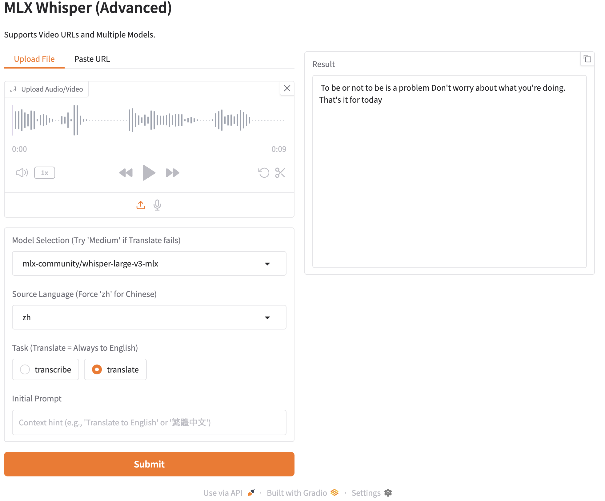

# ⚠️ Modified Fork for Pinokio

This fork is customized to support Video URLs, Model Switching, and UI fixes.

### 🚀 Changelog
1.  **Integrated `yt-dlp`:**
    -   Added a "Paste URL" tab to download audio from YouTube, TikTok, etc. automatically.
2.  **Model Selector:**
    -   Added dropdown to switch between `whisper-large-v3-turbo` (Fast), `whisper-large-v3` (High Quality), and `whisper-medium` (Balanced).
    -   *Why?* The Turbo model sometimes refuses to translate; switching to Medium/Large fixes this.
3.  **UI Improvements:**
    -   Added **Language Dropdown** (Forces `zh` to fix hallucinations).
    -   Added **Task Selector** (Transcribe vs Translate).
    -   Added **Initial Prompt** input.

---
*(Original README follows below)*
---
# `mlx-whisper` Web UI

Fast STT (Speach-to-Text) Web UI with mlx-whisper. The model is Whisper Large-3-Turbo.

## Prerequisites

- Apple Silicon Mac
- Python `>=3.12`
- uv `>=0.4.0`

## Usage

Install the packages.

```bash
uv sync
```

Run the app.

```bash
uv run main.py
```

Open http://127.0.0.1:7860 with your browser and you can view the app.



## Reference

- [mlx-whisper · PyPI](https://pypi.org/project/mlx-whisper/)
- [gradio · PyPI](https://pypi.org/project/gradio/)
- [openai/whisper: Robust Speech Recognition via Large-Scale Weak Supervision](https://github.com/openai/whisper)
